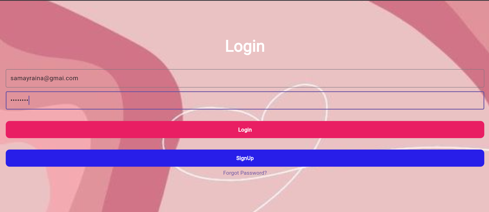
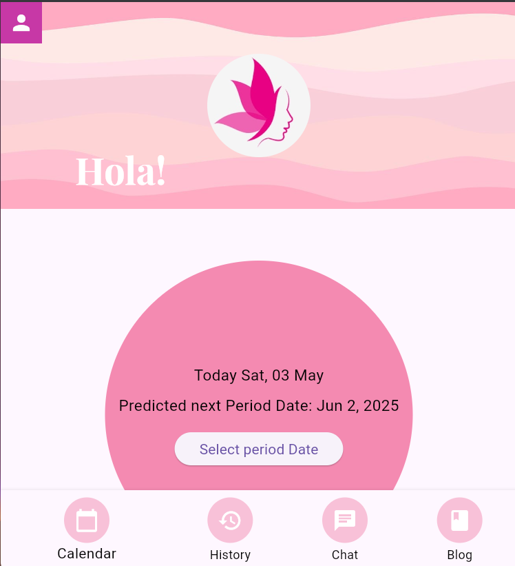
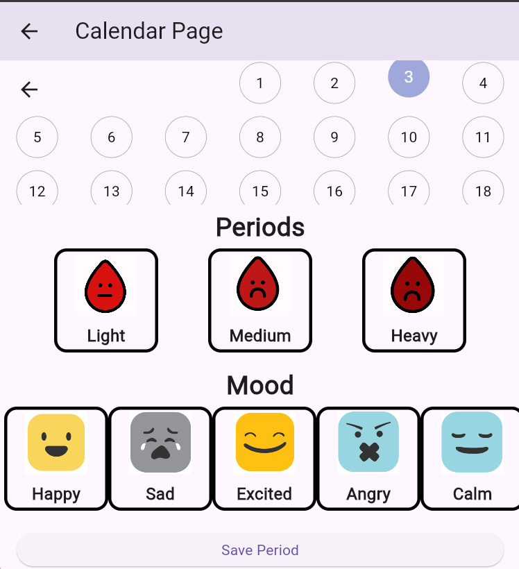
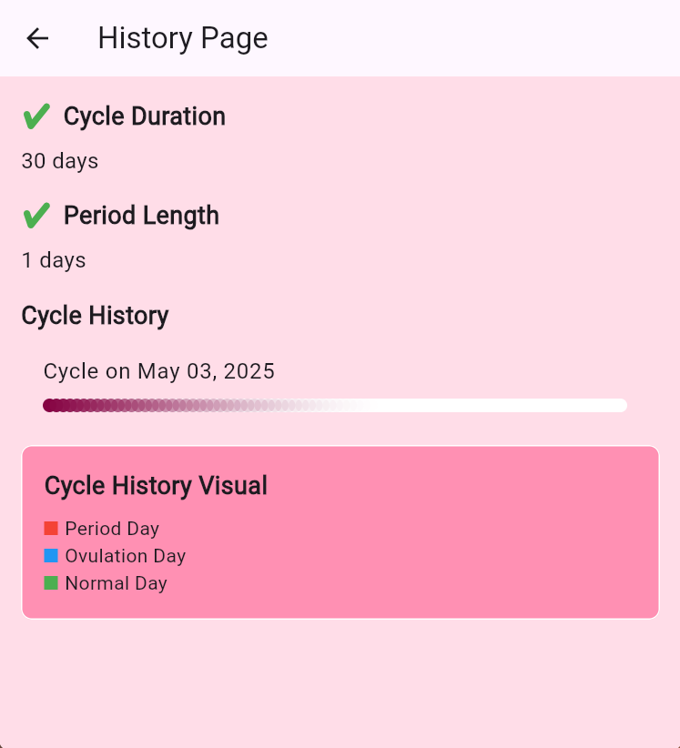
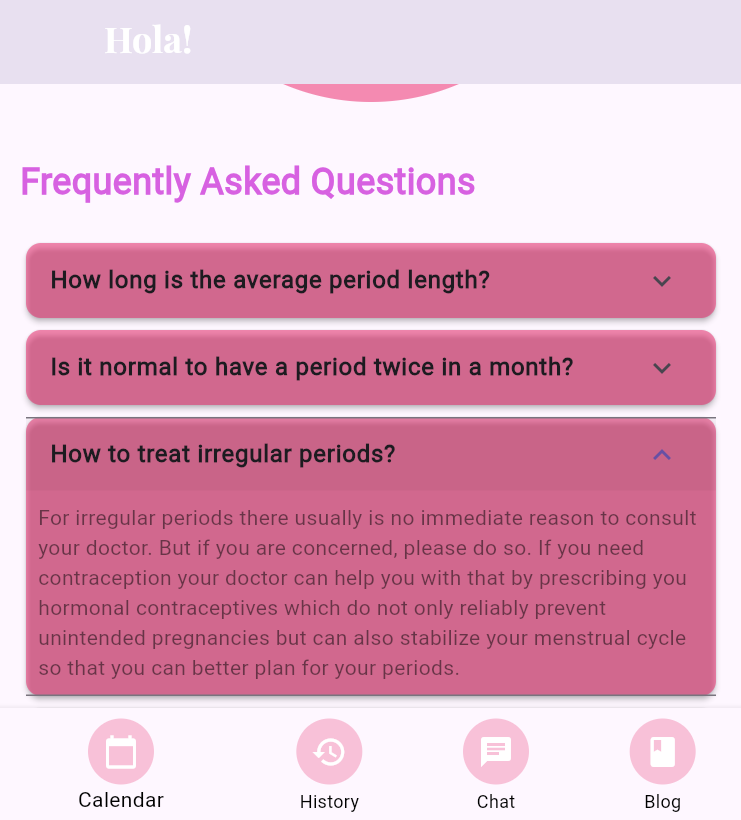
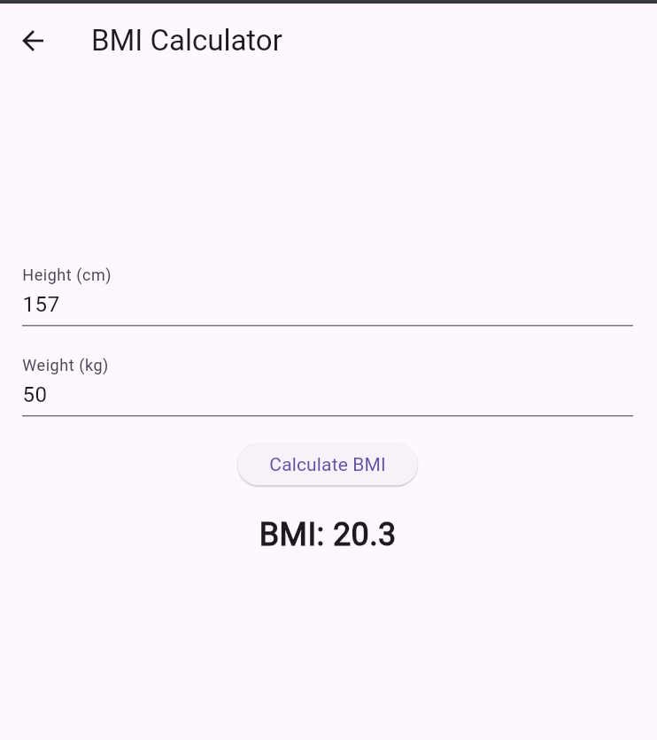
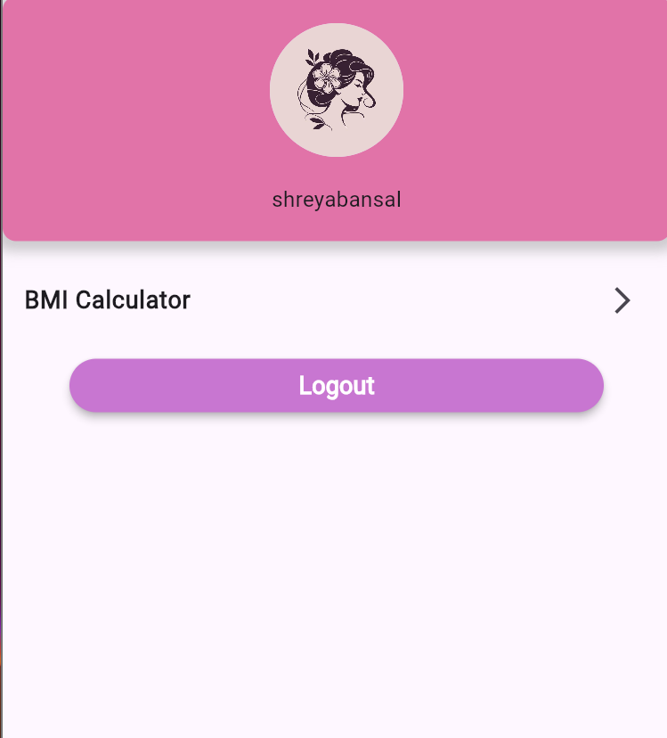

# 🌸 Period Tracker App

A smart, privacy-focused mobile and web app built with **Flutter** and powered by **Firebase**. This app helps users track their menstrual cycle, predict future periods using median logic, and access wellness tools like a BMI calculator and Gemini AI-powered chat.

---

## 🔗 Live Demo

👉 [Click here to try the live web version](https://my-firebase-project-62f59.web.app/)  
Try login with
---
# username-test, email-test@gmail.com, password-123456

---

## 📸 App Screenshots






---

## ✨ Features

- 📅 Mark period start dates manually
- 🔮 Predict next period using the median of previous data
- 🔐 Email-based Signup/Login with "Forgot Password" feature
- 📊 BMI Calculator for body health tracking
- 🧠 Chat with AI (Gemini by Google)
- 📚 Period-related blogs for user awareness
- 🧾 View full period history
- 🔥 Built using Firebase (Auth, Firestore) and Flutter Stack-based UI

---

## 🛠️ Getting Started

### 1. 📦 Prerequisites

- Install [Flutter SDK](https://docs.flutter.dev/get-started/install)
- Create a Firebase project (Web/Android/iOS apps)
- Generate a Gemini API key from [Google AI Studio](https://aistudio.google.com/app/apikey)

---

### 2. 🔧 Project Setup

```bash
git clone https://github.com/SimaranMaurya007/period-tracker-web-app.git
cd period-tracker-web-app
flutter pub get
```
### 3. 🔐 Add Firebase Config
Replace values in lib/main.dart with your actual Firebase credentials:
```bash
FirebaseOptions(
  apiKey: "YOUR_API_KEY",
  authDomain: "YOUR_AUTH_DOMAIN",
  projectId: "YOUR_PROJECT_ID",
  storageBucket: "YOUR_STORAGE_BUCKET",
  messagingSenderId: "YOUR_SENDER_ID",
  appId: "YOUR_APP_ID",
)
```
## Add Firebase config files:

Place google-services.json in:

android/app/

Place GoogleService-Info.plist in:

ios/Runner/

### 4. 🧠 Gemini Chat Setup (Optional)
To use the AI chat feature:
Get your API key from Google AI Studio.
Run the app with the Gemini API key passed as a Dart environment variable:
```bash
flutter run --dart-define=API_KEY=your_gemini_api_key
```
In your code, retrieve the API key with:
const apiKey = String.fromEnvironment('API_KEY');
